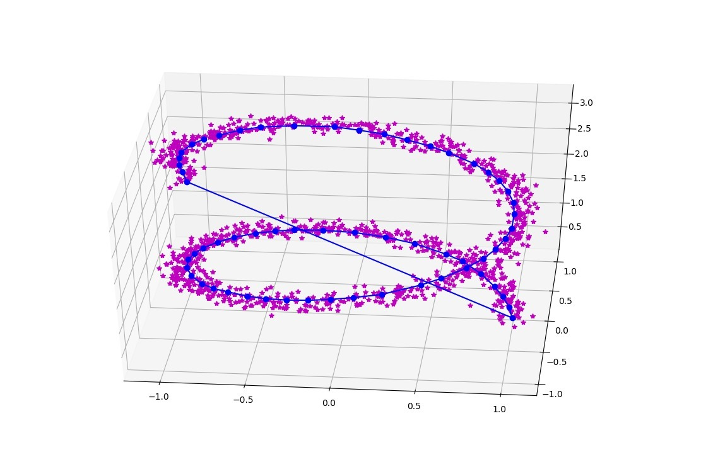
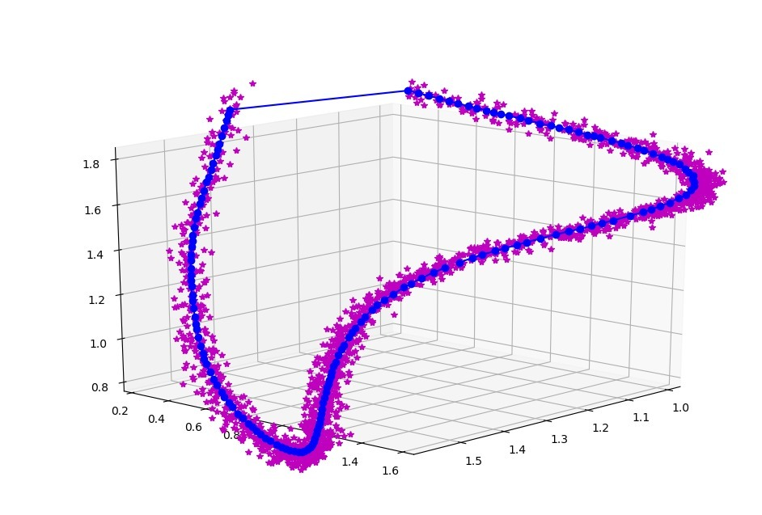
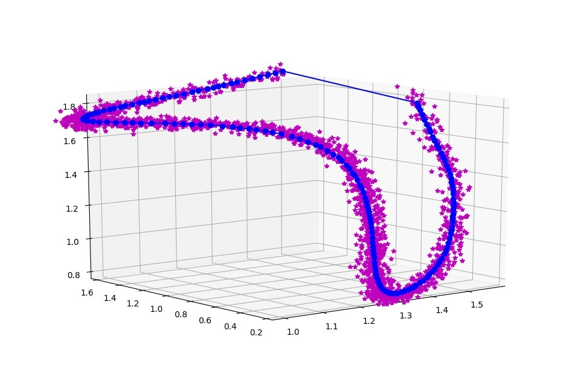

# 3D Point Cloud Curve Extraction

**Input Array:** Nx3 Array of Points in [x,y,z form]

1\. Thin points from 'points' array 

`thinned_points, regression_lines = thin_line(points)`

2\. Sort points

`sorted_points = sort_points(thinned_points, regression_lines)`

3\. Visualize

4\. Fine tune:
**thin_line**: `point_cloud_thickness` controls the radius in which points are selected to perform principle component analysis for.
**sort_points**: `sorted_point_distance` controls the radius adjacent points are selected for ordering the thinned curve.